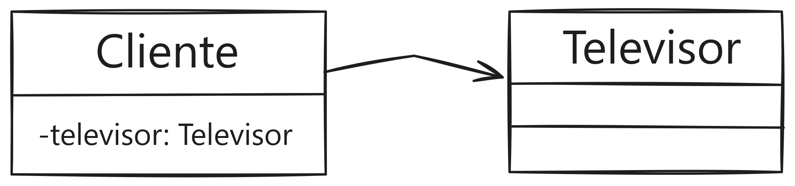

# Ejercicio Tipo Evaluación 1
# Enunciado
Una tienda electrónica, se encuentra en una etapa de expansión, por lo que busca una transformación digital, por lo cual ha decidido contratar los servicios para desarrollar un sistema que permite almacenar la información de los clientes y los productos disponibles para la venta. En esta ocasión existe una promoción atractiva que consiste en la baja de precios en televisores.

Para la venta de los televisores se requiere la información básica del cliente y del televisor. Considere que cada cliente puede comprar solo un televisor.
Determine 5 atributos para el cliente y 5 atributos para el televisor (como mínimo), que permitan guardar la información del televisor que comprará el cliente.

### Debe aplicar colaboración donde cliente tiene asociado un televisor y además debe cumplir con los siguientes requerimientos del cliente:
-	Debe existir un método que permita mostrar la información del televisor y el cliente.
-	Debe existir un método que permita realizar un descuento al televisor, dependiendo del cliente y del valor. Si el cliente es nuevo, el televisor se aplicará un descuento de 5%.

### Implemente las siguientes reglas de negocio:
-	La fecha de compra debe considerar 10 caracteres y que incluya “/”, ejemplo: “22/01/2022”
-	El cliente puede ser nuevo (N) o frecuente (F).
-	El precio del televisor debe ser superior a los $450.000.
-	El nombre del cliente y del vehículo no deben ser vacíos.
-	Incluya un correo de cliente donde debe contener un @ 

Además, ambas clases deben tener los siguientes métodos implementados: constructores, accesadores, mutadores y de impresión.

### Desde una clase que contiene el main debe contener un menú que permita:
-	Crear un televisor a un cliente.
-	Mostrar la información del cliente y televisor incluyendo descuentos.

### Diagrama de referencia:

Recordar que se debe programar en java aplicando todas las convenciones aprendidas en clase. 