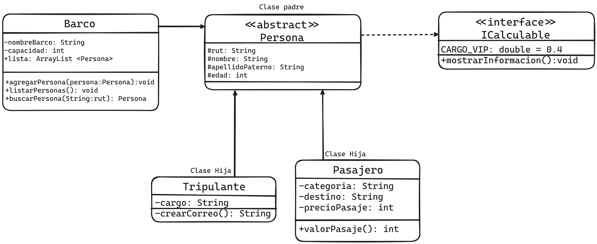

# Ejercicio Tipo Evaluación 2
# Enunciado
Un crucero, requiere una aplicación que permita registrar tanto información de los pasajeros como los de los tripulantes para ello se tiene el siguiente diagrama:

- La clase Persona, debe contener el siguiente método abstracto: 
```Java
public abstract void listarTodaPersona();
 ```
 método que es sobrescrito por las clases hijas, que arrojará toda la información correspondiente.

### Requerimientos
- Todas las clases incluyen ambos constructores, métodos mutadores (set), accesadires (get).
- Debe implementar las definiciones de la interface.
- La edad de las personas debe ser mayor o igual a 0.
- Categoría solo puede ser: 'V' (vip) o 'N' (normal).
- Nombre y apellidos no pueden ser vacíos.
- ```crearCorreo()``` , debe tomar la primera letra del nombre y el apellido completo más “@viajeros.com”.
- el valor del pasaje(), debe arrojar el precio a pagar. Tendrá un recargo extra del 40% (CARGO_VIP) más, en aquellos pasajeros que la categoría es vip.
- En main genere 3 objetos, agréguelos a la colección lista, luego listarlos y finalmente buscar una persona por RUT.

### Diagrama de referencia:


Recordar que se debe programar en java aplicando todas las convenciones aprendidas en clase. 